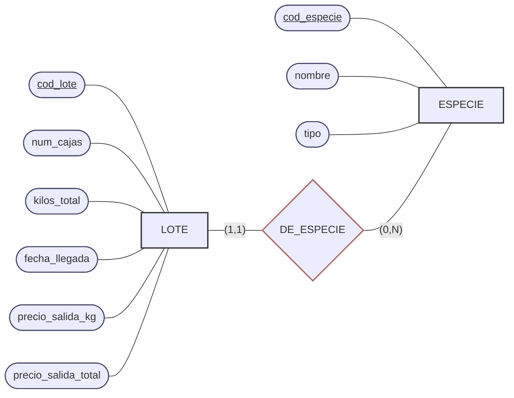

```mermaid

flowchart LR
    classDef entidad stroke:#333,stroke-width:2px;
    classDef relacion stroke:#a66,stroke-width:2px;
    classDef atributo stroke:#446,stroke-width:1.5px;

    %% Entidades
    Lote[LOTE]:::entidad
    Especie[ESPECIE]:::entidad

    %% Interrelación
    DeEspecie{DE_ESPECIE}:::relacion

    %% Atributos de LOTE
    cod_lote(["<u>cod_lote</u>"]):::atributo --- Lote
    num_cajas([num_cajas]):::atributo --- Lote
    kilos_total([kilos_total]):::atributo --- Lote
    fecha_llegada([fecha_llegada]):::atributo --- Lote
    precio_kg([precio_salida_kg]):::atributo --- Lote
    precio_total([precio_salida_total]):::atributo --- Lote

    %% Atributos de ESPECIE
    cod_especie(["<u>cod_especie</u>"]):::atributo --- Especie
    nombre_especie([nombre]):::atributo --- Especie
    tipo_especie([tipo]):::atributo --- Especie

    %% Cardinalidades (mínimo, máximo)
    Lote ---|"(1,1)"| DeEspecie
    DeEspecie ---|"(0,N)"| Especie

```
