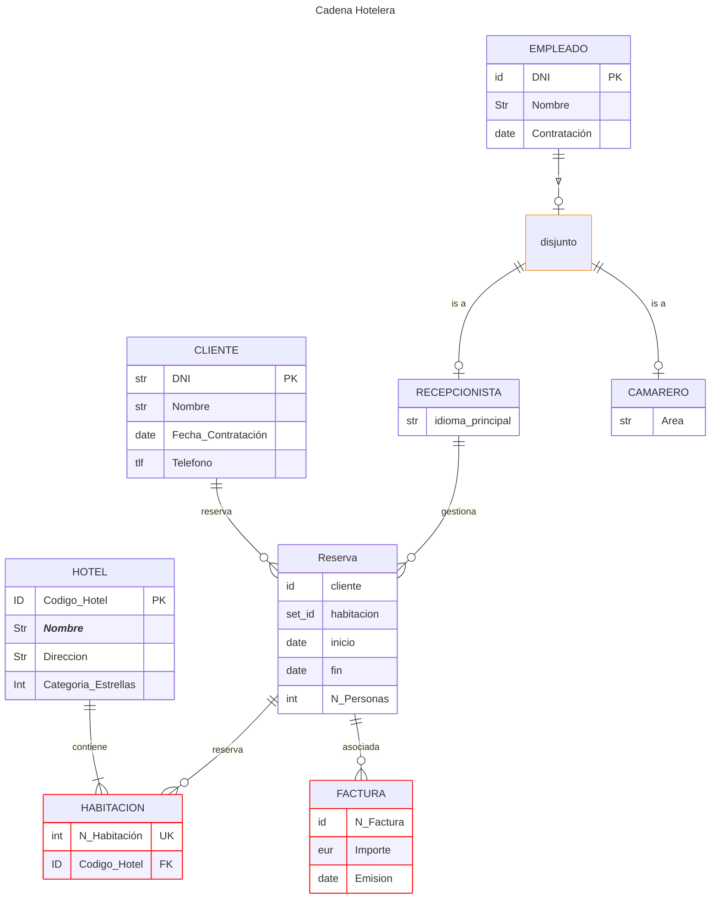

Una cadena hotelera necesita modelar su gestión, para lo cual debemos construir una base de datos y
previamente modelizar el caso:

a) Identifica entidades, atributos y relaciones:

b) Representa el esquema en un diagrama E/R Extendido:

c) Recuerda indicar las restricciones de cardinalidad y participación en cada relación.

d) Identifica y expón los dominios correspondientes a cada atributo.

e) Indica la semántica supuesta y perdida si las hubiera.

• La cadena hotelera administra varios Hoteles, identificados por un código de hotel. Cada hotel tiene un nombre
único, dirección y categoría (número estrellas).

• Cada hotel contiene múltiples Habitaciones, éstas se identifican por un número de habitación dentro de cada uno
(hotel).

• Los Clientes hacen Reservas de habitaciones:

• El cliente está identificado por DNI, y deseamos conocer también su nombre, dirección y teléfono.

• De la reserva hay que conocer la fecha de inicio, la fecha de fin y el número de personas.

• Sabemos que una reserva puede incluir varias habitaciones, pero cada habitación pertenece a una única reserva en ese intervalo.

• De todos los Empleado, necesitamos almacenar el DNI, el nombre, y la fecha de contratación. 

Éstos se clasifican en:

• Recepcionistas, con idioma principal.

• Camareros, con área asignada (bar, restaurante, etc.).

• Toda Reserva debe estar gestionada por un único Recepcionista.

• Una Factura está siempre asociada a una Reserva. La factura se identificada por un número correlativo dentro de la

Reserva y contiene el importe total y la fecha de emisión

