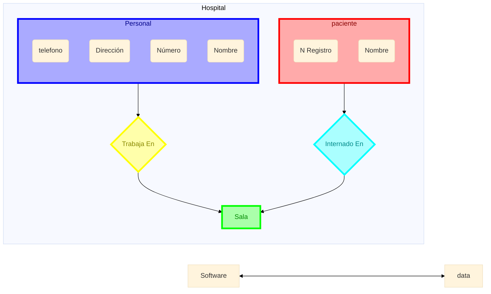

# Tema 1

### Ejemplo: Modelo Entidad Relación Extendido (ERE)

Obtener el esquema conceptual correspondiente a las salas de un hospital:
a. En una clínica se lleva un registro de pacientes, un registro de personal y uno de
salas con el personal que trabajan en esas salas y con los pacientes internados en
dichas salas.
b. Del personal nos interesa el número de empleado, el nombre, la dirección y el
teléfono. Sabemos que dos empleados no tienen el mismo numero.
c. De los pacientes nos interesa el número de registro (que les es asignado cuando
ingresan, diferente para cada uno de ellos) y el nombre, mientras que de las salas
nos interesa el nombre y la cantidad de camas que tiene. Nos indican que dos
salas no tienen el mismo nombre.
d. También se sabe que un empleado trabaja en una única sala, pero en una sala
pueden trabajar varios empleados.
e. Con los pacientes ocurre igual, es decir un paciente está en una única sala, pero en
una sala pueden estar ingresados varios pacientes.

